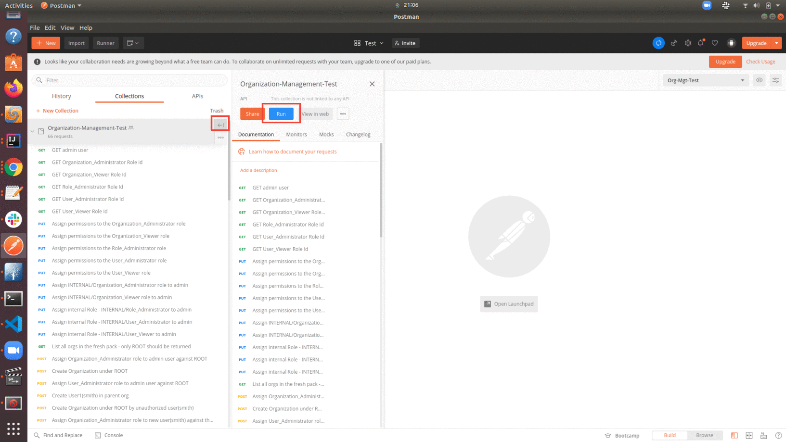
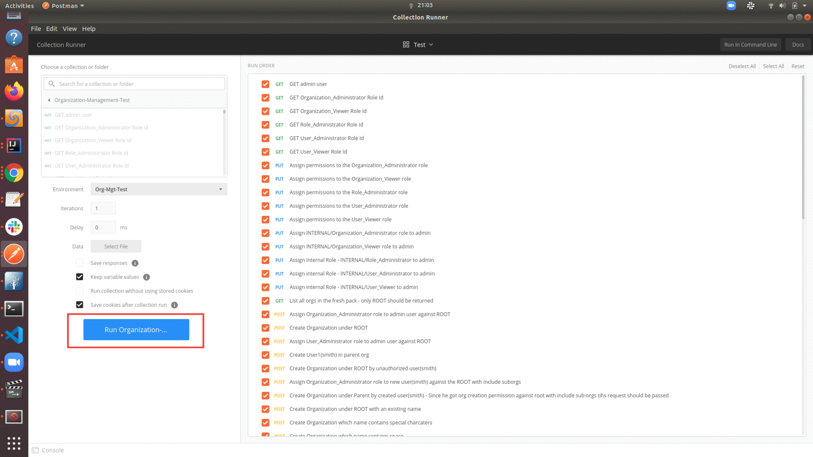
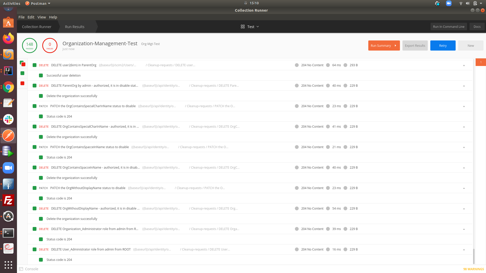

# Organization-Mgt-Postman-Test

1. Download WSO2-IS 5.10.0 WUM updated pack fresh pack.

2. Configure the WSO2-IS pack according to the requirement.

3. Login to the management console and create the following INTERNAL roles.
    - `Organization_Administrator`
    - `Organization_Viewer`
    - `User_Administrator`
    - `User_Viewer`
    - `Role_Administrator`
    - `Role_Viewer`
    
4. Download Postman. (https://www.postman.com/downloads/)

5. Import `Organization-Management-Test.postman_collection.json` file (https://developer.ft.com/portal/docs-start-install-postman-and-import-request-collection)

6. Run the test collection.

**STEP-1 :**

**STEP-2 :**

!NOTE: If you want to view the response bodies and headers after the test run, click the "Save responses" option.

7. **Test Result :**

If you want to view the test results given in the repo,

1. Navigate to Postman and click on **File -> New Runner Window**.
    
2. Click on **Import Runs** on theright upper corner and select the TestResult.json file.
